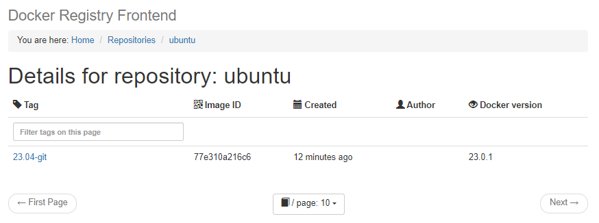

# 付録2.4 プライベートリポジトリ

書籍では[著者が公開しているGitHubリポジトリ](https://github.com/takara9/registry)を利用する方法で説明されているが，2024年6月現在ではリポジトリがなくなっている為，以下を参考にしてプライベートリポジトリを構築する．

- [第48回 Dockerプライベートレジストリにユーザー認証を付けるには（概要編）](https://www.itmedia.co.jp/enterprise/articles/1709/25/news017.html)
- [第49回 Dockerプライベートレジストリにユーザー認証を付ける（準備編）](https://www.itmedia.co.jp/enterprise/articles/1710/02/news018.html)
- [第50回 Dockerプライベートレジストリにユーザー認証を付ける（活用編）](https://www.itmedia.co.jp/enterprise/articles/1710/16/news016.html)

## (1)システム構成

以下の機能を持つプライベートレジストリを構築する．  
認証機能付きのレジストリを構築する予定であったが，docker-registry-frontendが認証に対応していない為，認証機能は省略する．

- dockerコマンドからレジストリへの登録(push)，ダウンロード(pull)が可能
- ブラウザからレジストリが保有する全リポジトリのリスト表示，リポジトリの詳細表示が可能

### 環境設定ファイルの作成

`/etc/docker/daemon.json`に以下を追記する．

```
"insecure-registries":["192.168.100.2:5000"]
```

## (3)レジストリの起動と停止

### 起動
```
$ docker-compose up -d --build
```

### 停止

```
$ docker-compose down
```

### イメージの登録

```
$ docker tag ubuntu:23.04-git 192.168.100.2:5000/ubuntu:23.04-git
$ docker push 192.168.100.2:5000/ubuntu:23.04-git
$ docker push 192.168.100.2:5000/ubuntu:23.04-git
The push refers to repository [192.168.100.2:5000/ubuntu]
5ce3706d57b0: Pushed
48143ecdba52: Pushed
23.04-git: digest: sha256:c37ddcb5093a3054deb976dfa4c050f306b46cf7fa4da311eee0288b9551e077 size: 741
```

### リポジトリ一覧の表示

```
$ curl http://192.168.100.2:5000/v2/_catalog
{"repositories":["ubuntu"]}
```



### イメージの削除

書籍ではプライベートリポジトリに登録したイメージを削除する手順が記載されていないが，以下の手順で削除することができる．

#### タグの削除

タグは`curl`で`DELETE`を送信することで削除できる．

```
$ curl -i -H "Accept: application/vnd.docker.distribution.manifest.v2+json" 192.168.100.2:5000/v2/ubuntu/manifests/23.04-git
HTTP/1.1 200 OK
Content-Length: 741
Content-Type: application/vnd.docker.distribution.manifest.v2+json
Docker-Content-Digest: sha256:c37ddcb5093a3054deb976dfa4c050f306b46cf7fa4da311eee0288b9551e077
Docker-Distribution-Api-Version: registry/2.0
Etag: "sha256:c37ddcb5093a3054deb976dfa4c050f306b46cf7fa4da311eee0288b9551e077"
X-Content-Type-Options: nosniff
Date: Sat, 06 Jul 2024 11:37:50 GMT

{
   "schemaVersion": 2,
   "mediaType": "application/vnd.docker.distribution.manifest.v2+json",
   "config": {
      "mediaType": "application/vnd.docker.container.image.v1+json",
      "size": 2144,
      "digest": "sha256:7399d06d535c5c10ec149a3311d3178814f4606879f98b29229eea2ac1ececf0"
   },
   "layers": [
      {
         "mediaType": "application/vnd.docker.image.rootfs.diff.tar.gzip",
         "size": 27663335,
         "digest": "sha256:efcc827fbbb39a149bce1b1b0951eccfa438d1d84153744033dd253856da8a08"
      },
      {
         "mediaType": "application/vnd.docker.image.rootfs.diff.tar.gzip",
         "size": 57406618,
         "digest": "sha256:2cd838e20c78e949fcd24e55f3455c31d519e3b5f497773bfce9c9861cf117dd"
      }
   ]
}$ curl -X DELETE 192.168.100.2:5000/v2/ubuntu/manifests/sha256:c37ddcb5093a3054deb976dfa4c050f306b46cf7fa4da311eee0288b9551e077
```


#### リポジトリの削除

リポジトリはサーバ上のディレクトリを削除するしかない模様．

```
$ docker-compose exec docker-registry sh
/ # cd /var/lib/registry/docker/registry/v2/repositories
/var/lib/registry/docker/registry/v2/repositories # ls
ubuntu
/var/lib/registry/docker/registry/v2/repositories # rm -rf ubuntu/
/var/lib/registry/docker/registry/v2/repositories # 
```


