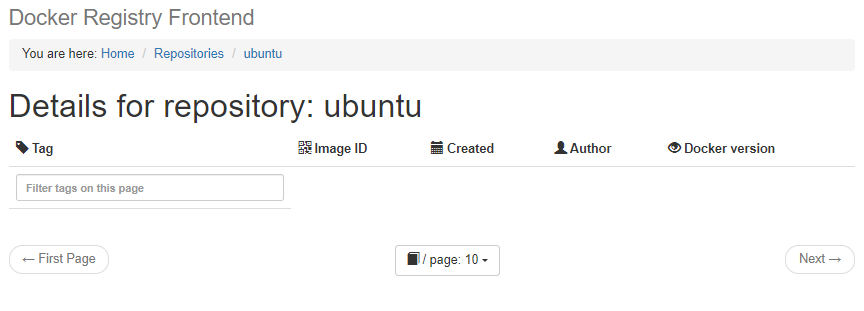
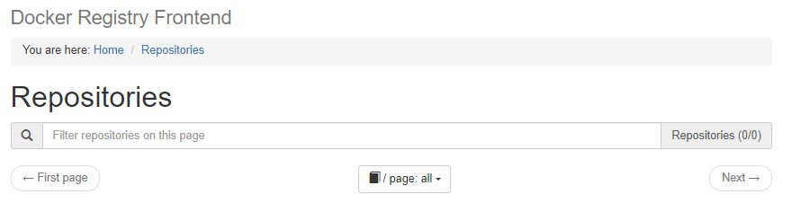

# 付録2.4 プライベートリポジトリ

書籍では[著者が公開しているGitHubリポジトリ](https://github.com/takara9/registry)を利用する方法で説明されているが，2024年6月現在ではリポジトリがなくなっている為，以下を参考にしてプライベートリポジトリを構築する．

- [第48回 Dockerプライベートレジストリにユーザー認証を付けるには（概要編）](https://www.itmedia.co.jp/enterprise/articles/1709/25/news017.html)
- [第49回 Dockerプライベートレジストリにユーザー認証を付ける（準備編）](https://www.itmedia.co.jp/enterprise/articles/1710/02/news018.html)
- [第50回 Dockerプライベートレジストリにユーザー認証を付ける（活用編）](https://www.itmedia.co.jp/enterprise/articles/1710/16/news016.html)

## (1)システム構成

以下の機能を持つプライベートレジストリを構築する．  
認証機能付きのレジストリを構築する予定であったが，docker-registry-frontendが認証に対応していない為，認証機能は省略する．

- dockerコマンドからレジストリへの登録(push)，ダウンロード(pull)が可能
- ブラウザからレジストリが保有する全リポジトリのリスト表示，リポジトリの詳細表示が可能

### 環境設定ファイルの作成

`/etc/docker/daemon.json`に以下を追記する．

```
"insecure-registries":["192.168.100.2:5000"]
```

## (3)レジストリの起動と停止

### 起動
```
$ docker-compose up -d --build
```

### 停止

```
$ docker-compose down
```

### イメージの登録

```
$ docker tag centos:7-git 192.168.100.2:5000/centos:7-git
$ $ docker push 192.168.100.2:5000/centos:7-git
The push refers to repository [192.168.100.2:5000/centos]
14aa6be18d2e: Pushed
174f56854903: Pushed
7-git: digest: sha256:9e6c89cf020e96cb89627f63d234f0da5c3b3dcc313ba1b3552fe01a8a7a04ea size: 742
```

### リポジトリ一覧の表示

```
$ curl http://192.168.100.2:5000/v2/_catalog
{"repositories":["centos"]}
```


### イメージの削除

書籍ではプライベートリポジトリに登録したイメージを削除する手順が記載されていないが，以下の手順で削除することができる．

#### タグの削除

タグは`curl`で`DELETE`を送信することで削除できる．

```
$ curl -i -H "Accept: application/vnd.docker.distribution.manifest.v2+json" 192.168.100.2:5000/v2/centos/manifests/7-git
HTTP/1.1 200 OK
Content-Length: 742
Content-Type: application/vnd.docker.distribution.manifest.v2+json
Docker-Content-Digest: sha256:9e6c89cf020e96cb89627f63d234f0da5c3b3dcc313ba1b3552fe01a8a7a04ea
Docker-Distribution-Api-Version: registry/2.0
Etag: "sha256:9e6c89cf020e96cb89627f63d234f0da5c3b3dcc313ba1b3552fe01a8a7a04ea"
X-Content-Type-Options: nosniff
Date: Sat, 29 Jun 2024 23:28:22 GMT

{
   "schemaVersion": 2,
   "mediaType": "application/vnd.docker.distribution.manifest.v2+json",
   "config": {
      "mediaType": "application/vnd.docker.container.image.v1+json",
      "size": 2722,
      "digest": "sha256:6ee9bb14ce23eefc6f2cc61b080ec8ea1b0839e4497e7c9ef6e8ceaae97f3f86"
   },
   "layers": [
      {
         "mediaType": "application/vnd.docker.image.rootfs.diff.tar.gzip",
         "size": 76097157,
         "digest": "sha256:2d473b07cdd5f0912cd6f1a703352c82b512407db6b05b43f2553732b55df3bc"
      },
      {
         "mediaType": "application/vnd.docker.image.rootfs.diff.tar.gzip",
         "size": 159942653,
         "digest": "sha256:ab836e6fae9798732b012b04146db2b765bf7590ed3afb6602700a7eaa5eaa80"
      }
   ]
$ curl -X DELETE 192.168.100.2:5000/v2/centos/manifests/sha256:9e6c89cf020e96cb89627f63d234f0da5c3b3dcc313ba1b3552fe01a8a7a04ea
```



#### リポジトリの削除

リポジトリはサーバ上のディレクトリを削除するしかない模様．

```
$ docker-compose exec docker-registry sh
/ # cd /var/lib/registry/docker/registry/v2/repositories
/var/lib/registry/docker/registry/v2/repositories # ls
centos
/var/lib/registry/docker/registry/v2/repositories # rm -rf centos/
/var/lib/registry/docker/registry/v2/repositories # 
```


