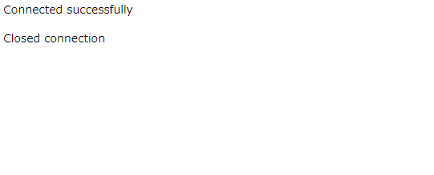

# Step04-コンテナとネットワーク

## Step04.1 コンテナネットワーク

|コマンド|説明|
|:--|:--|
|`docker network ls`|ネットワークの一覧を表示する|
|`docker network create`|ネットワークを作成する|
|`docker network rm`|ネットワークを削除する|
|`docker network inspect`|ネットワークの詳細を表示する|
|`docker network connect`|コンテナをネットワークに接続する|
|`docker network disconnect`|コンテナをネットワークから切断する|

```
$ docker network ls
NETWORK ID     NAME                                                DRIVER    SCOPE
d70314469dc4   appendix24-private-repository_docker-registry-net   bridge    local
e8f9ffcf0b91   host                                                host      local
215e02f7bb99   none                                                null      local
```

```
$ docker network create my-network
$ docker network ls
NETWORK ID     NAME                                                DRIVER    SCOPE
d70314469dc4   appendix24-private-repository_docker-registry-net   bridge    local
e8f9ffcf0b91   host                                                host      local
215e02f7bb99   none                                                null      local
2b667193d75a   my-network                                          bridge    local
```

```
$ docker run -d --name webserver1 --network my-network nginx:latest
530d0b1ec4202b0e1ac06869ae8bebf5626ce3edfa51fc859295b3dd309da4c3
$ docker ps
CONTAINER ID   IMAGE          COMMAND                  CREATED         STATUS         PORTS      NAMES
530d0b1ec420   nginx:latest   "/docker-entrypoint.…"   8 seconds ago   Up 3 seconds   80/tcp     webserver1
```

## Step04.2 外部向けにポートを公開する

```
$ docker run -d --name webserver1 -p 3000:80 nginx:latest
3627a7298d7299294dfec8c98f1440098b5fda0ee121a6a9c86887c5cc875cc5
```

### localhostでアクセス

```
$ curl http://localhost:3000
<!DOCTYPE html>
<html>
<head>
<title>Welcome to nginx!</title>
<style>
html { color-scheme: light dark; }
body { width: 35em; margin: 0 auto;
font-family: Tahoma, Verdana, Arial, sans-serif; }
</style>
</head>
<body>
<h1>Welcome to nginx!</h1>
<p>If you see this page, the nginx web server is successfully installed and
working. Further configuration is required.</p>

<p>For online documentation and support please refer to
<a href="http://nginx.org/">nginx.org</a>.<br/>
Commercial support is available at
<a href="http://nginx.com/">nginx.com</a>.</p>

<p><em>Thank you for using nginx.</em></p>
</body>
</html>
```

### IPアドレスでアクセス

IPアドレスは，`ifconfig`コマンドの`eth0`を確認する．

```
$ curl http://172.26.101.182:3000
<!DOCTYPE html>
<html>
<head>
<title>Welcome to nginx!</title>
<style>
html { color-scheme: light dark; }
body { width: 35em; margin: 0 auto;
font-family: Tahoma, Verdana, Arial, sans-serif; }
</style>
</head>
<body>
<h1>Welcome to nginx!</h1>
<p>If you see this page, the nginx web server is successfully installed and
working. Further configuration is required.</p>

<p>For online documentation and support please refer to
<a href="http://nginx.org/">nginx.org</a>.<br/>
Commercial support is available at
<a href="http://nginx.com/">nginx.com</a>.</p>

<p><em>Thank you for using nginx.</em></p>
</body>
</html>
```

## Step04.3 APコンテナとDBコンテナの連携例

APコンテナとは，アプリケーションコンテナのことであり，DBコンテナとは，データベースコンテナのことである．  

### (1)コンテナネットワークの作成

```
$ docker network create apl-net
deb9c56c90f29b6aa73964adf7ccea5f0e348b8d90e792a1ad99948c6d1d84bf
```

### (2)MySQLサーバの起動

```
$ docker run -d --name mysql --network apl-net -e MYSQL_ROOT_PASSWORD=password mysql:9.0.0
```

### (3)テスト用アプリケーションのコンテナ開発

```
$ cd apl-container
$ docker build -t php-apl:0.1 .
[+] Building 3.7s (9/9) FINISHED
 => [internal] load .dockerignore                                                                                                      0.5s
 => => transferring context: 2B                                                                                                        0.0s 
 => [internal] load build definition from Dockerfile                                                                                   0.8s 
 => => transferring dockerfile: 298B                                                                                                   0.1s
 => [internal] load metadata for docker.io/library/php:8.3.8-apache                                                                    2.2s
 => [internal] load build context                                                                                                      0.4s
 => => transferring context: 58B                                                                                                       0.0s 
 => [1/4] FROM docker.io/library/php:8.3.8-apache@sha256:6c5e79726c6507ffe2f6cb284fd6f8f43da0e8bc9132d218110461a99d8d6376              0.0s 
 => CACHED [2/4] RUN apt update && apt install -y     libmcrypt-dev default-mysql-client     zip unzip git vim                         0.0s
 => CACHED [3/4] RUN docker-php-ext-install pdo_mysql session                                                                          0.0s 
 => CACHED [4/4] COPY php/ /var/www/html/                                                                                              0.0s 
 => exporting to image                                                                                                                 0.1s 
 => => exporting layers                                                                                                                0.0s 
 => => writing image sha256:0b5aba991f4c56ad7556b6a488ee32b8defd25be1c90e201bbf026f0628e0566                                           0.1s 
 => => naming to docker.io/library/php-apl:0.1  $ docker run -d --name php --network apl-net -p 3000:80 -e MYSQL_USER=root -e MYSQL_PASSWORD=password php-apl:0.1
5e11d9766baf884236c252517905da317149cab26a5c60136647345926e2a6f4
```


